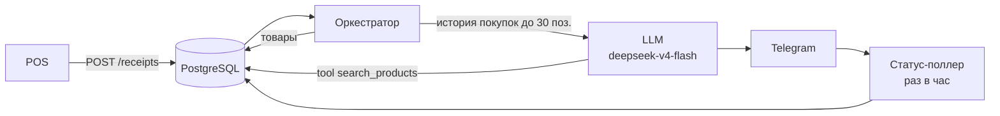

# 🔄 Buyback

> Сервис **ИИ-холодных продаж** для розничной сети.

Система следит за покупками клиентов, а нейросеть генерирует **персонализированные предложения** сопутствующих товаров — так, будто вас помнит живой продавец-консультант.


---

## ✨ Идея

**Проблема:** у магазинов мало рекламы, акции не озвучиваются, клиенты не знают о сопутствующих товарах.

**Решение:** каждый раз, когда клиент покупает что-то в магазине, сервис:

1. Сохраняет позиции чека (до **30 штук**).
2. По расписанию выбирает «спящих» клиентов.
3. Нейросеть анализирует историю покупок и генерирует тёплое сообщение с предложением **релевантного товара**, который реально есть в наличии.
4. Отправляет сообщение в **Telegram**.

---

## 🧩 Как это работает



---

## 🚀 Возможности

| Возможность | Где |
|---|---|
| 🔌 Приём POS-транзакций | `POST /api/v1/receipts` |
| 🧠 AI-генерация персонализированных сообщений через LLM | `services/ai.py` |
| 🛍️ Tool-calling: нейронка проверяет наличие товара в БД | `search_products` |
| ⏰ Оркестратор по расписанию (раз в 2 недели) | `services/orchestrator.py` |
| 📬 Отправка через Telegram | `services/telegram.py` |
| ✅ Поллер доставки (раз в час) | `services/status_poller.py` |
| 🎭 Демо-ручка для презентаций | `GET /api/v1/demo` |

---

## 📚 API

Интерактивная документация — [Swagger UI](http://localhost:8000/docs) · OpenAPI — `/openapi.json`

| Метод | Путь | Назначение | Авторизация |
|---|---|---|---|
| `POST` | `/api/v1/receipts` | Принять чек от POS | `X-API-Key` |
| `POST` | `/api/v1/trigger-orchestrator` | Запустить цикл оркестратора | `X-API-Key` |
| `GET` | `/api/v1/demo` | Демо: случайный чек + случайный номер + запуск оркестратора | — |
| `GET` | `/health` | Health-check | — |

### 💳 Приём чека

```bash
curl -X POST http://localhost:8000/api/v1/receipts \
  -H "X-API-Key: changeme" \
  -H "Content-Type: application/json" \
  -d '{
    "phone_number": "+79991234567",
    "receipt_data": "Перфоратор DeWalt D25133K; Сверло по бетону 6х110; Уровень лазерный",
    "receipt_datetime": "2026-01-15T12:00:00Z"
  }'
```

```json
{
  "id": "3fa85f64-5717-4562-b3fc-2c963f66afa6",
  "receipt_datetime": "2026-01-15T12:00:00Z",
  "data": "Перфоратор DeWalt D25133K; Сверло по бетону 6х110; Уровень лазерный",
  "person_id": "6fa81e5a-81d0-4a8b-a4a8-9b27b04c1f8b"
}
```

> 💡 `receipt_datetime` должен быть в UTC. Новая позиция добавляется к клиенту автоматически;
> если позиций уже 30 — самая старая удаляется.

### 🎬 Демо (для презентации)

```bash
curl http://localhost:8000/api/v1/demo
```

Отправит чек со **случайным товаром** и **случайным номером телефона**, запустит оркестратор
и вернёт HTML-страницу. Рекомендация прилетит в Telegram.

---

## ⚙️ Стек технологий

| Слой | Технологии |
|---|---|
| Язык | Python ≥ 3.13 |
| Веб-фреймворк | FastAPI, Uvicorn |
| ORM | SQLAlchemy 2.0 (async) + asyncpg |
| БД | PostgreSQL 16 |
| Планировщик | APScheduler |
| AI | LLM OpenAI-compatible → `deepseek-v4-flash` (tool-calling) |
| Интеграции | Telegram |
| Инфраструктура | Docker + Docker Compose, uv |

---

## 🛠️ Быстрый старт

### Требования

- Python ≥ 3.13
- [uv](https://docs.astral.sh/uv/)
- Docker + Docker Compose

### Локальный запуск

```bash
cp .env.example .env      # поправьте секреты
uv sync                    # установить зависимости
docker compose up -d db    # поднять PostgreSQL
uv run uvicorn buyback.main:app --reload --port 8000
```

Документация: http://localhost:8000/docs

### Полный запуск в Docker

```bash
cp .env.example .env
docker compose up -d --build
```

---

## 🧰 Разработка

```bash
make install    # установить зависимости
make format     # форматирование (ruff)
make lint       # линтер (ruff)
make fix        # автофикс линтера
make test       # запуск тестов
make pre-commit # format + lint + test
```

---

## 🔑 Переменные окружения

Полный список — в [`.env.example`](.env.example).

| Переменная | Описание |
|---|---|
| `COMMON_API_KEY` | Ключ авторизации ручек (`X-API-Key`) |
| `LLM_API_KEY` / `LLM_BASE_URL` / `LLM_MODEL` | Провайдер нейросети (OpenAI-compatible) |
| `TELEGRAM_BOT_TOKEN` / `TELEGRAM_CHAT_ID` | Настройки Telegram-бота |
| `ORCHESTRATOR_INTERVAL_DAYS` | Период оркестратора (дни) |
| `STATUS_POLLER_INTERVAL_MINUTES` | Период поллера доставки (минуты) |

---

## 📁 Структура проекта

```
buyback/
├── src/buyback/
│   ├── main.py                  # FastAPI-приложение, роутеры, планировщик
│   ├── api/
│   │   ├── receipts.py          # POST /api/v1/receipts
│   │   └── deps.py              # X-API-Key авторизация
│   ├── services/
│   │   ├── orchestrator.py      # выбор клиентов + генерация + отправка
│   │   ├── ai.py                # LLM-генерация, tool search_products
│   │   ├── channel.py           # канал доставки (telegram)
│   │   ├── telegram.py          # отправка через Telegram
│   │   ├── status_poller.py     # проверка доставки
│   │   └── persons.py           # Person / ReceiptItem логика
│   ├── models.py                # SQLAlchemy-модели
│   ├── schemas.py               # Pydantic-схемы
│   └── config.py                # настройки (pydantic-settings)
├── tests/                       # тесты (pytest)
├── docker-compose.yml           # db + app
├── Dockerfile
└── Makefile
```

---

## 📦 Модели данных

```python
class Person:          # клиент
    id: UUID
    phone_number: str

class ReceiptItem:     # позиция чека (макс. 30 на клиента)
    id: UUID
    receipt_datetime: datetime
    data: str
    person: Person

class Product:         # товар из каталога
    id: UUID
    name: str

class Status:          # статус отправки
    id: UUID
    sending_datetime: datetime
    sending_data: str
    send_status: IN_PROCESS | SEND
    message_id: str
    person: Person
```

---

## 📬 Канал доставки

Сообщения отправляются в **Telegram**:

```env
TELEGRAM_BOT_TOKEN=123456:ABC...
TELEGRAM_CHAT_ID=000000000
```

---

## 🤝 Вклад

1. Форкните репозиторий
2. Создайте ветку: `git checkout -b feature/awesome`
3. Внесите изменения и прогоните `make pre-commit`
4. Откройте Pull Request
